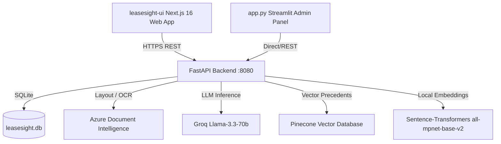

# 🔍 LeaseSight

> **Dynamic Visual Lease Auditor & Precedent Query Engine**
>
> An enterprise-grade AI-powered Lease Extraction and Auditing platform. LeaseSight processes raw lease contracts, extracts critical clauses via a multi-agent pipeline (Miner, Judge, Clerk), generates 3D similarity correlation maps of precedent leases, and offers a document-scoped chat interface with real-time visual anchoring/bounding box highlighting.

---

## 🚀 Key Features

*   **Multi-Agent AI Pipeline**: Employs specialized LLM agents—**Miner** (for clause extraction), **Judge** (for risk assessment & validation), and **Clerk** (for structured data storage)—to perform consistent, deep audits.
*   **OCR & Layout Analysis**: Utilizes **Azure Document Intelligence** to analyze document layouts, retrieve text coordinate maps, and visually highlight exact clause locations.
*   **Dynamic Precedent Mapping**: Indexes document sections to **Pinecone** using **local embeddings (`all-mpnet-base-v2`)** to visualize internal query heatmaps and 3D database context relationships.
*   **Scoped Document Chat**: Ask questions directly to your leases. The assistant will answer and automatically jump/scroll to the exact source page in the document preview.
*   **Multi-Tenancy Segregation**: Client database namespaces isolate tenancy scopes, keeping data separated and secure.

---

## 🏗️ Architectural Overview



---

## 🛠️ System Prerequisites

Ensure you have the following installed on your system before proceeding:

*   **Python 3.11.x** (Required for the Backend, Streamlit Admin App, and Scripts)
*   **Node.js 18+** & **npm** (Required for the Next.js Frontend)
*   **Docker** (Optional, for building/running containerized backend)
*   **Git** (Recommended)

---

## 🔑 Environment Configuration

You must create configuration files containing secret API keys for both the Backend and Frontend.

### 1. Backend Configuration (`.env`)
Create a file named `.env` in the root project directory:

```ini
# Core API Keys
GROQ_API_KEY=gsk_your_groq_api_key
PINECONE_API_KEY=pcsk_your_pinecone_api_key
AZURE_ENDPOINT=https://your-resource.cognitiveservices.azure.com/
AZURE_KEY=your_azure_document_intelligence_key

# Optional
GEMINI_API_KEY=your_google_gemini_key
```

### 2. Frontend Configuration (`leasesight-ui/.env.local`)
Create a file named `.env.local` inside the `leasesight-ui/` directory:

```ini
# Clerk Authentication Configuration
NEXT_PUBLIC_CLERK_PUBLISHABLE_KEY=pk_test_your_development_key
CLERK_SECRET_KEY=sk_test_your_development_secret

# API Server Endpoint
NEXT_PUBLIC_API_URL=http://localhost:8080
```

---

## ⚡ Step-by-Step Setup Guide

Follow these sequential steps to set up and run the workspace.

### Step 1: Clone the Repository
```bash
git clone https://github.com/ZainUlAbideen02/LeaseSight.git
cd LeaseSight
```

### Step 2: Set Up Python Virtual Environment (Backend)
Activate your virtual environment and install the required Python packages.

```bash
# Create environment
python -m venv venv

# Activate on Windows (PowerShell)
venv\Scripts\Activate.ps1

# Activate on macOS / Linux
source venv/bin/activate

# Install core dependencies
pip install -r requirements.txt
```

> 💡 **NVIDIA GPU Users**: If you wish to run `sentence-transformers` embeddings on GPU, install the matching PyTorch CUDA library:
> ```bash
> pip install torch==2.3.1+cu118 --extra-index-url https://download.pytorch.org/whl/cu118
> ```
> *CPU-only setups require no extra steps; standard libraries will run out-of-the-box.*

### Step 3: Install Frontend Dependencies
Open a separate terminal window, navigate to the frontend directory, and install the package dependencies.

```bash
cd leasesight-ui
npm install
```

---

## 🚀 Running the Project

To run the complete LeaseSight ecosystem locally, start the following three services:

### 1. Start the FastAPI API Backend
From the root workspace directory with the virtual environment activated:

```bash
uvicorn api.main:app --host 0.0.0.0 --port 8080 --reload
```
*   **API URL**: `http://localhost:8080`
*   **Interactive Docs (Swagger)**: `http://localhost:8080/docs`
*   **Health Check Endpoint**: `http://localhost:8080/api/health`

### 2. Start the Streamlit Admin UI
The Streamlit app acts as a dashboard/admin panel to quickly test document uploads, coordinates mappings, and 3D vector plots.

```bash
streamlit run app.py
```
*   **Streamlit URL**: `http://localhost:8501` (by default)

### 3. Start the Next.js Frontend App
From the `leasesight-ui` directory:

```bash
npm run dev
```
*   **Frontend Web App**: `http://localhost:3000`

---

## 🐳 Running with Docker (Backend Only)

A hardened `Dockerfile` is provided for containerizing the API server.

1.  **Build the Docker Image**:
    ```bash
    docker build -t leasesight-backend:latest .
    ```

2.  **Run the Container**:
    Make sure you have your `.env` configured in the host root directory before running this command.
    ```bash
    docker run -d \
      --name leasesight-api \
      -p 8080:8080 \
      --env-file .env \
      -v "$(pwd)/data:/app/data" \
      --restart unless-stopped \
      leasesight-backend:latest
    ```

---

## 🚢 Production Deployment

The project provides automation scripts for production deployment (specifically configured for Caddy & Azure environment).

*   `DEPLOY.sh`: Rebuilds the docker container, triggers Next.js static production build (`npm run build`), syncs the HTML output to Caddy's root directory (`/var/www/leasesight-ui`), and reloads Caddy with the correct CORS configuration.
*   `RESTART_ALL.sh`: Cleans and restarts all backend docker containers and reloads Caddy.
*   `CADDY_RESET.sh`: Diagnostics tool for Caddy web server certificates.
*   `DIAGNOSE_SSL.sh` & `FIX_SSL_NOW.sh`: Troubleshoots LetsEncrypt/ZeroSSL problems on production domains.

Production configurations map the production API to `api.leasesights.tech` and the frontend interface to `www.leasesights.tech`.

---

## 🔍 Troubleshooting

*   **First Run Sentence-Transformers Model Download**:
    On your first audit run, `sentence-transformers` downloads the embedding weight files (`all-mpnet-base-v2`, ~420MB) to cache. Make sure you have a working internet connection. Subsequent starts are instantaneous.
*   **ChromaDB / SQLite Errors on Windows**:
    If you see visual schema loading errors, try upgrading ChromaDB dependencies:
    ```bash
    pip install chromadb --upgrade
    ```
*   **Port 8080/3000 already in use**:
    You can specify a different port when booting:
    *   **Backend**: `uvicorn api.main:app --port 8000 --reload`
    *   **Frontend**: Set `PORT=3001` or let Next.js prompt you automatically.
    *   On Windows, you can also run the utility script to free up locked ports:
        ```powershell
        powershell -ExecutionPolicy Bypass -File .\scripts\free_ports.ps1
        ```
