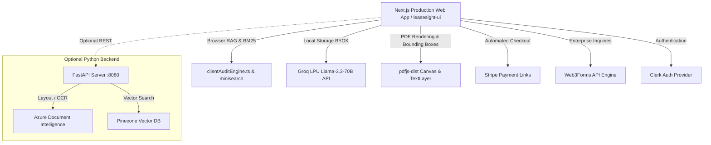

# 🔍 LeaseSight

> **AI-Powered Lease Extraction, Audit & Compliance Platform**
>
> An enterprise-grade AI-powered Lease Extraction and Auditing platform built for modern commercial real estate, legal, and procurement teams. LeaseSight processes raw lease contracts, scores risks against a weighted compliance matrix, extracts visual bounding boxes mapped 1:1 to original PDF source text, and syncs critical obligation deadlines to your calendar.

---

## 🚀 Key Features

*   **Hybrid Client-Side & Server RAG Audit Engine**: Tokenizes and indexes extracted PDF layout lines using `minisearch` and BM25 scoring. Evaluates contract spans across key compliance categories (Governing Law, Termination & Default, Notice Periods, Liability Caps).
*   **Weighted Criticality Risk Matrix**: Evaluates contractual terms across Low (+1), Medium (+2), and Critical (+4) risk levels to calculate realistic risk scores with zero generic fallbacks.
*   **Direct PDF Document Grounding**: Interactive bounding box highlights (`#f59e0b` glowing amber overlays) positioned 1:1 over rendered PDF canvas text spans (`pdfjs-dist`).
*   **Flexible Compute & BYOK (Bring Your Own Key)**: Choose between high-speed managed Groq LPU inference or plug in custom Groq/OpenAI API keys stored locally in browser storage for zero-fee, local-first processing.
*   **Automated Stripe Payments & Credits System**: Integrated Stripe Payment Links for $5/mo Starter Subscriptions (25 audits/mo) and $5 Pay-As-You-Go top-ups (10 audit credits) with instant account credit syncing.
*   **Enterprise Briefing & Contact Engine**: Web3Forms-backed contact pipeline routing inquiries and briefing requests directly to `241475@students.au.edu.pk`.

---

## 🏗️ Architectural Overview



---

## 📁 Repository Structure

```
LeaseSight/
├── leasesight-ui/           # Primary Next.js 16 Production Frontend Web Application
│   ├── src/
│   │   ├── app/             # App Router pages (Landing, Dashboard, Audit, Pricing, Settings)
│   │   ├── components/      # UI components (Header, LeftPane, RightPane, Modals, Bounding Boxes)
│   │   └── lib/             # Audit engine, BM25 scoring, PDF parser, Local document store
│   └── package.json
├── api/                     # (Optional) FastAPI Python Backend Server
├── app.py                   # (Optional) Streamlit Admin Testing UI
├── requirements.txt         # Python backend dependencies
├── README.md                # Main repository documentation
└── README_SETUP.md          # Step-by-step local setup guide
```

---

## 🔑 Environment Configuration

### Frontend Configuration (`leasesight-ui/.env.local` or Vercel Environment Variables)

```ini
# Clerk Authentication Configuration
NEXT_PUBLIC_CLERK_PUBLISHABLE_KEY=pk_test_...
CLERK_SECRET_KEY=sk_test_...

# API Server Endpoint (Optional for client-first audit mode)
NEXT_PUBLIC_API_URL=http://localhost:8080
```

### Python Backend Configuration (`.env` in root)

```ini
GROQ_API_KEY=gsk_your_groq_api_key
PINECONE_API_KEY=pcsk_your_pinecone_api_key
AZURE_ENDPOINT=https://your-resource.cognitiveservices.azure.com/
AZURE_KEY=your_azure_document_intelligence_key
```

---

## ⚡ Step-by-Step Quick Start

### 1. Running the Next.js Web App (Primary)

```bash
cd leasesight-ui
npm install
npm run dev
```

Open `http://localhost:3000` in your browser.

### 2. (Optional) Running the Python FastAPI Backend

```bash
# Create & activate virtual environment
python -m venv venv
venv\Scripts\Activate.ps1   # Windows PowerShell
# source venv/bin/activate  # macOS / Linux

# Install dependencies
pip install -r requirements.txt

# Start FastAPI server
uvicorn api.main:app --host 0.0.0.0 --port 8080 --reload
```

---

## 🚢 Production Deployment

The frontend is deployed to Vercel Production:

```bash
cd leasesight-ui
npm run build
npx vercel --prod
```

- **Production Web Application**: [https://www.leasesights.tech](https://www.leasesights.tech)

---

## 📄 License & Attribution

© 2026 LeaseSight Technologies. All rights reserved.
